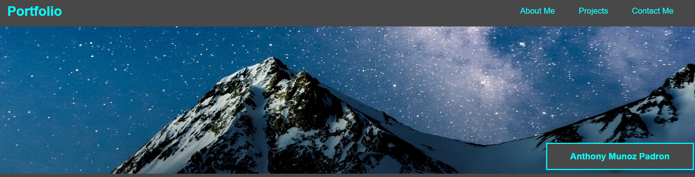

Anthony Munoz Padron: Portfolio Website

This a starter website for a soon to be developer. 
The website has a basic structure with a header, nav, a body with different sections and a footer.

The header starts with a Title and a nav. When you click on the nav, it'll take you to the different sections of the webpage. There's a hero with a mountain underneath the night sky. My name can be see on bottom right corner of the hero.

Next will be the body and its different sections. The sections are: About Me, Projects, Contact Info.
The About Me section has a paragraph that talks about my own personal biography.

