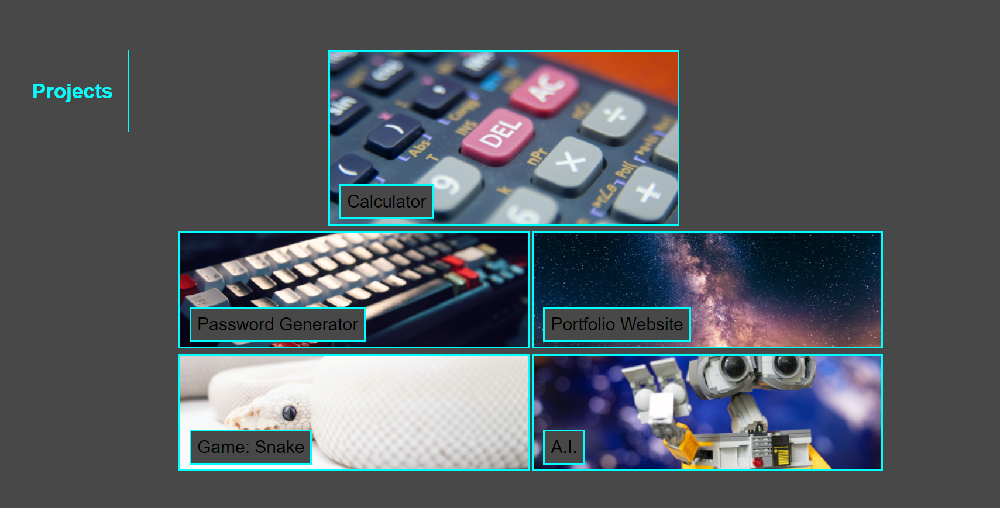

Anthony Munoz Padron: Portfolio Website

This a starter website for a soon to be developer. 
The website has a basic structure with a header, nav, a body with different sections and a footer.

The header starts with a Title and a nav. When you click on the nav, it'll take you to the different sections of the webpage. There's a hero with a mountain underneath the night sky. My name can be see on bottom right corner of the hero.

Next will be the body and its different sections. The sections are: About Me, Projects, Contact Info.
The About Me section has a paragraph that talks about my own personal biography.

Projects is the next section of the body. I added five different projects, although four of them
are just place holders for future projects that I wish to try out. When hovering over the images, the pictures will enlarge.

Underneath the images are false links except for one, when clicked on it'll take the user to the github website where they can find that 
specific project. 

As I mentioned before, the only picture with a functioning link is the "portfolio website" image. 
An other thing, I wasn't abl to fix the image proportions when enlarged. For most when hovering 
the image will be underneath another image.

The last section, Contact Info, has three different links on ways to contact me. 
I didn't a phone number for privacy reasons, but I will add one at some point.
The "Email" link has a link stored which contains my email, but I'm not sure if it's working properly. 
The "GitHub" link works like a charm, and directs the user to my GitHub page, where they are able to see my projects.

Lastly, the Footer Section. There's not much to say except that there are links that'll take you to the different 
sections of the website when clicked on

ERRORS
There are a lot of I didn't add, just cause I didn't have enough time, but I'm going to try and improve the website 
as time goes on.

here's a list of missing requiremnts or errors:
Different screen sizes are not arranged
, images in the project section overlap each other when you hover over them
, email link isn't working properly.

I'm sure there are more out there but those are the main concerns I forgot to add or fix. 